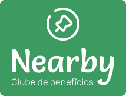
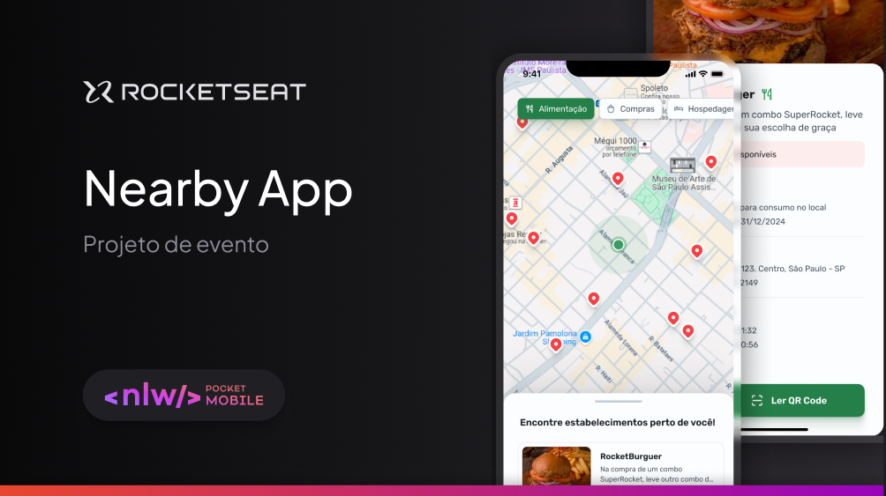
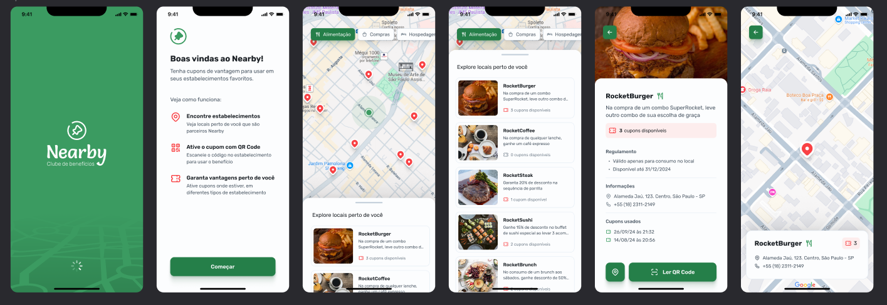

</a>

  
    

##  Nearby

Nearby é um aplicativo mobile de clube de benefícios com cupons para utilizar em estabelecimentos próximos a você.

Esse é o projeto do evento NLW Pocket Mobile, um dos conteúdos disponíveis para alunos da Rocketseat.

 

  

    

## Tecnologias utilizadas

- [**React Native**](https://reactnative.dev/)
- [**Expo**](https://expo.dev/)
- [**TablerIcons**](https://tabler.io/docs/icons/react-native)

## Licença

Este projeto está licenciado sob a licença MIT - consulte o arquivo LICENSE para mais detalhes.
